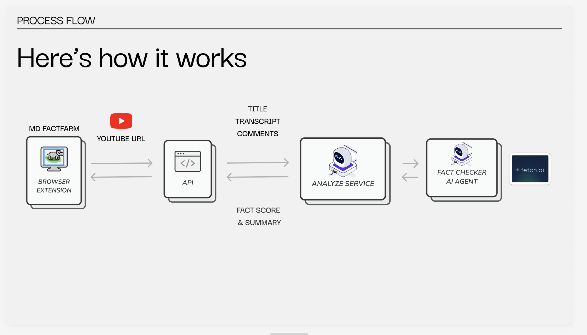

# MD Fact Farm
Social media platforms are now major sources of rapidly shared information. Our Chrome extension, MD FactFarm, simplifies fact-checking through AI-driven content analysis and verification. Initially focused on YouTube, our tool offers real-time fact-checking by scanning video content to identify and flag misinformation while providing reliable sources for users to verify accuracy.

[Read more](https://devpost.com/software/md-factfarm?ref_content=user-portfolio&ref_feature=in_progress)
## How to start this api server locally
0. Clone the repository
1. (Optional) Create a  python virtual environment, use what ever tool you like, I use anaconda
2. Install the required packages
```bash
pip install youtube-transcript-api
pip install openai
pip install flask
pip install flask-cors
pip install uagents-ai-engine
pip install uagents
```
4. add your openai api key and youtube key to openapi_service.py file
5. run fake news agent and api server
```bash
python fakenewsagnet.py
python api.py
```
6. The server should be running on localhost:5100, please validate by visiting the url in your browser
```bash
http://localhost:5100/api/v1/is-fake-news/sAmwIKTx9hs
```

## How it works

- API will receive youtube video id from client and return the result whether the video is fake news or not. 
- For now it determine if the video is fake news by pulling transcript, comments title of the video then send to uAgennts (fakenew agent) to determine if the video is fake news or not.